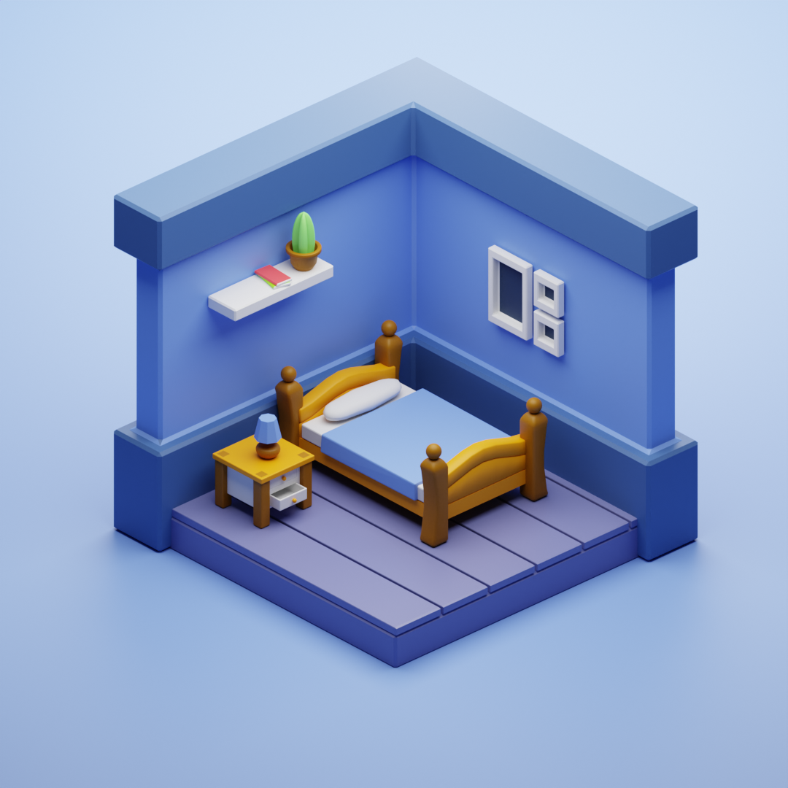

# Isometric Room

`v1.0.0`

My third Blender project was a following the amazing tutorial of [3DGreenhorn](https://www.youtube.com/channel/UCu0NnMWYiqPe5ffnGxwpnCg):

[Blender 3D - Create a 3D Isometric BEDROOM in 15 minutes | Beginner Tutorial](https://www.youtube.com/watch?v=yCHT23A6aJA&t=539s)

# Features
- Isometric
- Modifiers
- Modeling
- Lighting
- Materials
- Low-Poly