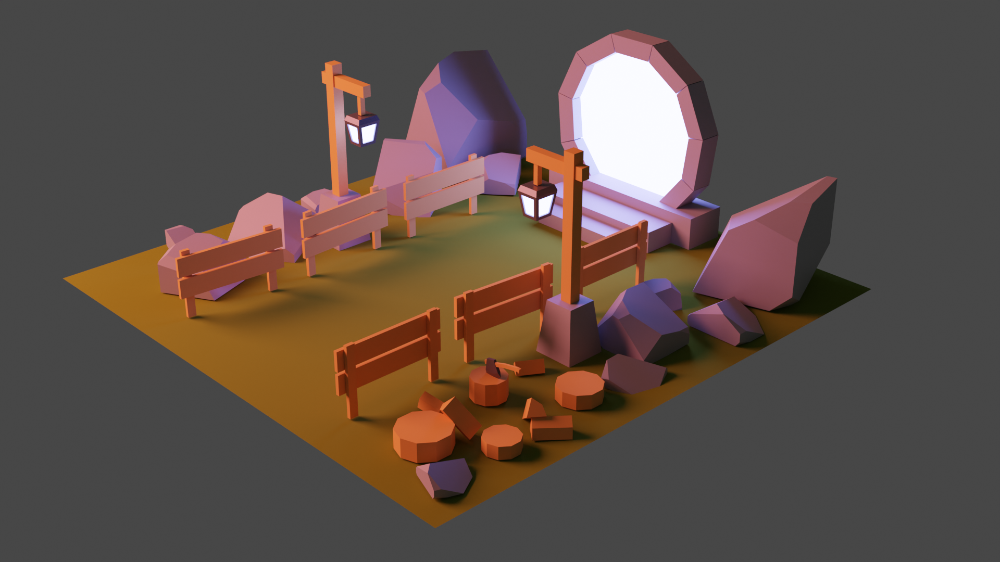
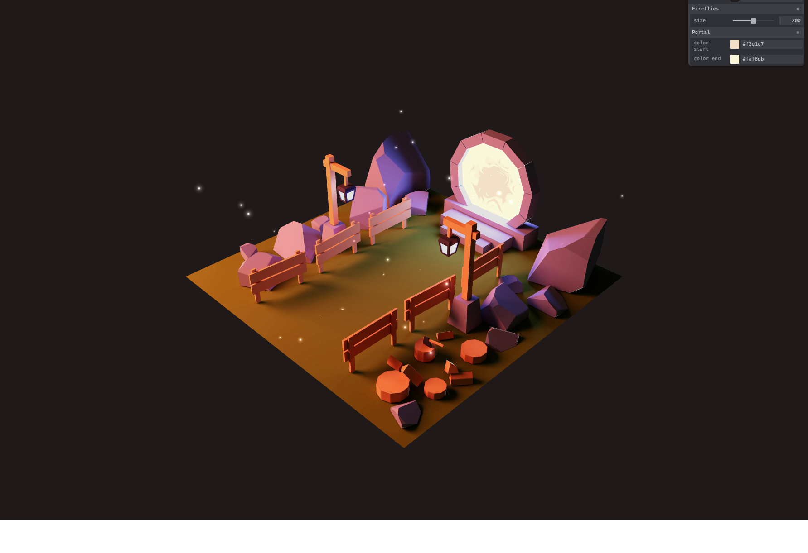

# Magical Portal

`v1.0.0`

My third Blender project was a following the amazing course of [ThreeJS-Journey](https://threejs-journey.com/)

The whole idea is to bake the textures and materials in Blender, and then export them with a `.gltf` model to a [ThreeJS](https://threejs.org/) scene.

Final scene:

